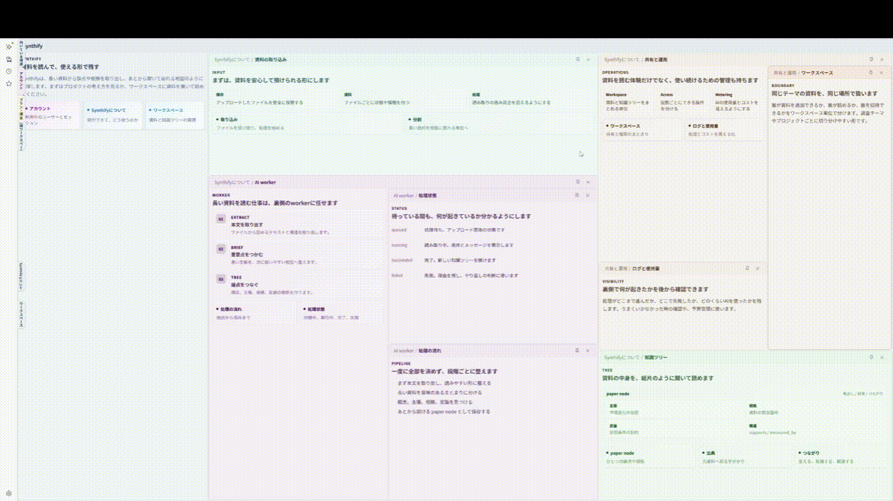

LLM を使うと情報は大量に出せますが、縦スクロールの画面では一度に見渡せる範囲が狭く、必要な情報を探し続ける負担が残ります。

Synthify は、アップロードしたドキュメントから知識ツリーを作り、情報を抽象から具体へ辿れるようにするアプリです。paper-in-paper で全体像を見ながら必要な paper だけを展開できるので、人間が知りたい情報を見つけやすくなります。



### E2Eテストとデバッグ

初回だけChromiumをインストールし、Playwrightを実行します。通常はDocker Composeの開発環境も自動で起動します。

```bash
cd apps/web
bunx playwright install chromium
bun run e2e
```

既に開発環境を起動している場合は、再利用すると速くなります。

```bash
E2E_REUSE_SERVER=1 bun run e2e
```

失敗を調べるときは、UIモード、headed実行、直前に失敗したテストだけの再実行を利用できます。

```bash
bun run e2e:ui
bun run e2e:headed
bun run e2e:last
bun run e2e:report
bun run e2e:pr       # Chromiumの通常suite（外部サービス非依存）
bun run e2e:repeat5  # flaky確認用に同じsuiteを5回反復
bun run e2e:nightly  # @nightly の外部統合確認だけ
```

失敗時のHTML reportにはtrace、screenshot、videoに加えて、browser console、page error、失敗した通信、4xx/5xx response、テスト開始後のComposeログが添付されます。認証tokenや共有tokenは診断出力でマスクされます。


ちょっと特殊な実装にしているところがいくつかあるので、ここにまとめておきます。

### API と worker の分担

認証、認可、課金、workspace/document/job の作成などは API が担当します。ドキュメント処理、chunking、LLM 呼び出し、tree 生成などの重い処理は worker に渡します。

worker は内部向け Cloud Run service です。stage/prod では API が Cloud Tasks に積み、起動・retry・backoff は Cloud Tasks に任せます。Cloud Scheduler は document 処理ではなく、LLM eval 用 Cloud Run Job の定期実行に使います。

worker から API への内部呼び出しは service token で認証し、ブラウザから直接叩ける経路とは分けています。

LLM 呼び出しの一時的な失敗も worker 側で指数 backoff して retry します。

### Firestore による完了通知

worker は job の進捗と完了状態を Firestore に書きます。frontend は Firestore の `onSnapshot()` で job status を購読します。完了を検知したら、それをトリガーに成果物を API に問い合わせます。

Firestore は通知と表示用の状態で、workspace/document/tree の正本は Postgres/API 側にあります。この構成により、frontend から API への progress polling をなくしています。

### paper-in-paper の iframe

paper-in-paper の HTML 本文は iframe の中で表示します。各 paper の CSS や script を親画面から隔離しています。

### ブラウザから GCS へ直接アップロード

ドキュメントの実体は API を経由しません。API は `CreateDocument` で document record、upload reservation、quota check、signed upload URL 発行をまとめてやります。frontend は返ってきた signed URL に対して、GCS へ直接アップロードします。

アップロード後に `StartProcessing` を呼びます。API は GCS object metadata を確認してから worker に処理を渡します。予約なしで upload URL だけを発行する経路は使いません。

### Worker は GCS FUSE でドキュメントを読む

worker は GCS bucket を GCS FUSE で filesystem として mount します。これにより、LLM がドキュメントを扱いやすくなります。例えば `grep` などのコマンドを tool として使いやすいです。

LLM による検索で、OpenSearch や PostgreSQL の部分一致検索を主経路にはしていません。worker が filesystem 上の成果物と tool を使って探索します。派生成果物や cache も filesystem 前提で扱えるので、LLM が段階的に読み進めやすいです。

### ログと観測データ

ログは用途ごとに保存先を分けています。

Cloud Run / Cloud Logging には、API と worker が stdout に出す `slog` JSON、Cloud Run request log、system log が残ります。主に障害時の一次切り分け用で、`job_id`、`workspace_id`、`document_id`、trace id などで調査します。

New Relic は API / worker の処理時間、Connect RPC、DB 呼び出し、error、明示的に送った custom event を集約します。stack trace、遅い処理、job 失敗の傾向分析に使います。

frontend には New Relic Browser を入れています。ブラウザ内で起きた JavaScript error、error boundary で捕捉した error、画面表示・遷移の遅さ、API 通信時間を New Relic に送ります。token、cookie、document 本文、アップロード内容、個人情報の本文値は送らず、カスタム属性は `user_id` など調査に必要な ID に限定します。

worker の job 実行ログは、Cloud Logging とは別に DB の `job_logs` / `job_mutation_logs` にも残します。これは job 単位の進行表示、失敗理由の確認、監査用です。

### 課金は Stripe とクレジット制

課金 provider は Stripe です。Checkout、Billing Portal、webhook、従量課金の外部連携は API 側に寄せています。

LLM usage はまず内部クレジットから消費し、クレジットを超えた分だけ Stripe に流します。モデルごとの重みは別に持っていて、Flash 系は軽く、Pro 系は重く扱えるようにしています。
