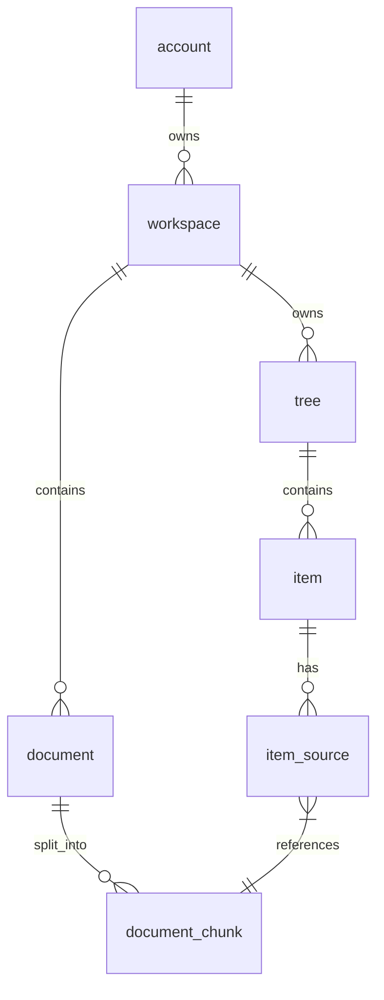

# Synthify データ依存関係と永続化仕様

本ドキュメントは、Synthify における `account / workspace / document / tree / item` の依存関係と、Postgres / GCS における永続化の仕組みを定義する。

---

## 1. エンティティ階層 (ER 図概要)

---

## 2. 主要エンティティの定義

### 2.1 `account`
ユーザーまたは組織の最上位単位。請求と権限の境界。

### 2.2 `workspace`
作業空間。特定のプロジェクトや文脈を共有する場所。

### 2.3 `document`
入力ソース。PDF やテキストファイル。GCS に実体を持ち、DB にメタデータを持つ。

### 2.4 `tree`
`document` 群を解析して得られた成果物の集合体。
以前は `graph` と呼んでいたが、現在は `1 workspace = 1 tree` の階層構造（Tree）として扱う。

### 2.5 `item`
`tree` の構成要素。
旧称 `node`。ラベル、レベル（深さ）、説明、要約（HTML）を持つ。

---

## 3. 永続化設計 (Postgres)

### 3.1 テーブル構造案

#### `trees`
- `tree_id` (ULID, PK)
- `workspace_id` (ULID, FK, UNIQUE) -- 1 workspace = 1 tree
- `created_at`

#### `items`
- `item_id` (ULID, PK)
- `tree_id` (ULID, FK)
- `parent_item_id` (ULID, FK, NULLABLE) -- Tree 構造を表現
- `label` (TEXT)
- `level` (INTEGER)
- `description` (TEXT)
- `summary_html` (TEXT)
- `governance_state` (TEXT) -- system_generated, human_curated 等
- `created_at`

#### `item_sources` (Provenance/根拠)
`item` がどの `document_chunk` から生成されたかを記録する。
- `item_id` (ULID, FK)
- `document_id` (ULID, FK)
- `chunk_id` (TEXT)
- `source_text` (TEXT) -- 生成時のスナップショット
- `confidence` (FLOAT)

---

## 4. 特記事項

### 4.1 `node` / `edge` から `item` への移行
以前の設計にあった `edge` テーブルは廃止し、`items.parent_item_id` による階層表現に一本化する。
これにより、複雑なグラフ構造から、直感的なツリー構造（Paper-in-Paper UI との親和性重視）へとシフトした。

### 4.2 ID 体系
すべての主要エンティティ (`account_id`, `workspace_id`, `document_id`, `tree_id`, `item_id`) には `ULID` を採用し、ソート可能性と分散生成を両立する。

### 4.3 Provenance (根拠の追跡)
`item` は常に 1 つ以上の `document_chunk` に紐付く。
LLM worker が `item` を生成する際、必ず `item_sources` にその根拠となるテキスト断片を記録しなければならない。

---

## 5. ストレージ (GCS)

- `documents/{account_id}/{document_id}/original.pdf`
- `documents/{account_id}/{document_id}/chunks/{chunk_id}.txt` (オプション)

基本的には、`document` の正本は GCS に置き、`item` の生成根拠としてのテキストスナップショットのみを Postgres (`item_sources`) に保持する。
