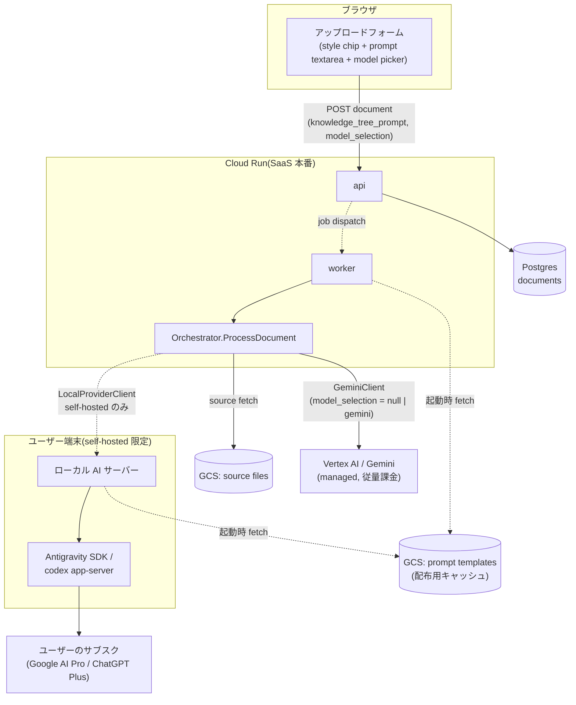
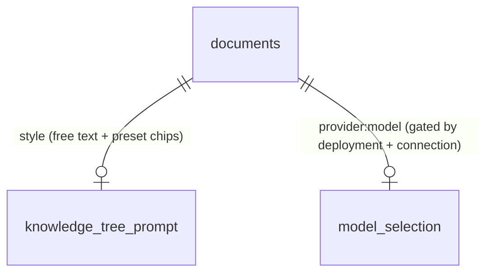
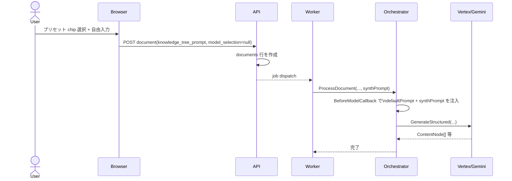
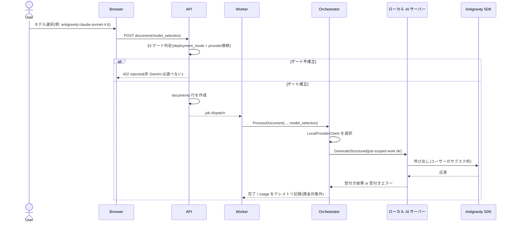
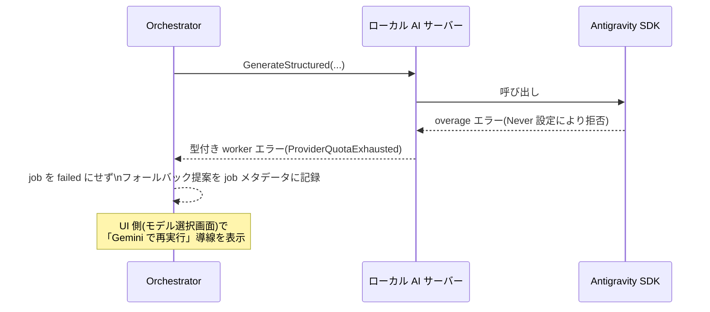
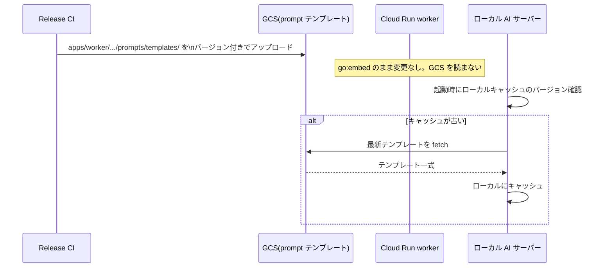

# System Design: モデル選択 & スタイル選択(ナレッジツリー生成)

[knowledge-tree-generation-spec.md](../core-domain/knowledge-tree-generation-spec.md) と
[local-llm-provider.md](../improvements/local-llm-provider.md) で決めた2つの機能
(スタイルプリセット選択・モデル選択)を、**同じアップロードフォーム・同じパイプライン**に
統合するときの実装設計。両ドキュメントの決定事項をそのまま前提にする。

## 0. スコープ

対象は **document upload → knowledge tree generation job**(Cloud Run worker が非同期に処理する
パイプライン)のみ。[paper-native-llm-interaction.md](../improvements/paper-native-llm-interaction.md)
が扱う対話(chat/dialogue)パイプラインは対象外 ── そちらは同期的にブラウザから呼ばれる別経路で、
本ドキュメントの「デプロイ形態と有効化されるモデル」の結論がそのまま当てはまらない(§2 参照)。

---

## 1. コンポーネント図



実線 = 本番 SaaS で常に通る経路。破線 = self-hosted 配備でのみ有効になる経路(§2)。

---

## 2. デプロイ形態と有効化されるモデルの対応(重要な訂正)

[local-llm-provider.md](../improvements/local-llm-provider.md) の Phase 5 は
「Antigravity/Codex 系のモデルは Phase 4 の provider 接続が確立している場合のみ選択肢に現れる」
とだけ書いたが、これは **必要条件であって十分条件ではない**。ここで訂正する。

Cloud Run 上の worker は Google のデータセンターで動くプロセスであり、ユーザーの端末で待ち受ける
`http://127.0.0.1:PORT` のローカル AI サーバーに **ネットワーク的に到達できない**。したがって:

- 配備形態 (a)(worker 内 provider seam)が成立するのは、worker とローカル AI サーバーが
  **同じホスト上にある場合のみ** ── つまり Synthify 自体を self-hosted で動かしているとき。
- Cloud Run 上で動く SaaS 本番の worker は、ユーザーが何を選ぼうと Antigravity/Codex に
  到達する手段がない。

Phase 4 の「provider 接続」(ユーザー/デバイス単位でどの provider が使えるか)は
**あくまで self-hosted インスタンス内でのユーザー識別**の話であり、SaaS 本番でこの機能を
有効化するかどうかとは別の軸。両方を満たして初めてローカル provider が選択肢に出る。

### ゲート条件(両方 true で初めて非 Gemini モデルが選択肢に出る)

| # | 条件 | 判定場所 | 既定値 |
|---|---|---|---|
| 1 | インスタンスが self-hosted 配備である(`DEPLOYMENT_MODE=self-hosted`。SaaS 本番/staging では常に unset) | worker 起動時、環境変数 | SaaS: 無効固定 |
| 2 | そのユーザー/デバイスに provider 接続がある(Phase 4) | API、リクエスト単位 | 未接続なら無効 |

この対応表を [Product boundary](../improvements/local-llm-provider.md#product-boundary) の表と
突き合わせると一致する: 「Synthify Personal / local」だけが Supported PoC target であり、
「Public multi-user Synthify Cloud」は managed provider(Gemini/Vertex)固定。

**UI 側の選択肢生成もこの2条件を両方クエリしてから組み立てる**(条件1を満たさない環境では
条件2の provider 接続 UI 自体を表示しない)。

---

## 3. データモデル

`documents` テーブルへの追加(両機能で共通、カラムは独立):

```sql
ALTER TABLE documents
  ADD COLUMN knowledge_tree_prompt TEXT NULL,  -- スタイル指定。chip 追記 + 自由入力
  ADD COLUMN model_selection       TEXT NULL;  -- 例: "gemini" (既定) | "antigravity:claude-sonnet-4.6"
                                                 --     | "antigravity:gpt-oss-120b" | "codex:gpt-5"
                                                 -- NULL は LLM_PROVIDER の既定値にフォールバック
```

`model_selection` に非 Gemini 値を書き込めるのは §2 のゲートを両方満たしたリクエストのみ。
API はゲート未達のリクエストで非 Gemini 値が来たら **保存前に拒否する**(UI 側の出し分けは
このガードの代替にならない ── [local-llm-provider.md](../improvements/local-llm-provider.md)
の fail-closed 方針をここでも維持する)。



---

## 4. シーケンス

### 4.1 通常経路(Gemini、スタイル指定あり)



### 4.2 モデル選択: ローカル provider 経路(self-hosted 限定、§2 のゲート成立時のみ)



### 4.3 overage 枯渇時のフォールバック



### 4.4 プロンプトテンプレート配布(GCS)



---

## 5. Fail-closed ガード一覧(集約)

複数ドキュメントに分散していたガード条件をここに集約する。実装時はこの一覧を網羅すること。

| ガード | 場所 | 破ったときの挙動 |
|---|---|---|
| `model_selection` が非 Gemini の場合、`DEPLOYMENT_MODE=self-hosted` が必要 | API(保存前) | 422 で拒否 |
| 非 Gemini の場合、Phase 4 の provider 接続が必要 | API(保存前) | 422 で拒否 |
| production/staging では `LLM_PROVIDER` は `gemini` 以外を worker 起動時に拒否 | worker 起動時 | 起動失敗(fail closed) |
| provider の認証情報・認証ファイルはブラウザに送らない | ローカル AI サーバー | 該当データを応答に含めない |
| ローカル provider の job 作業ディレクトリはユーザー/workspace 間で再利用しない | ローカル AI サーバー | job ごとに新規ディレクトリ、確実に削除 |
| `DELETE_NODE` 相当の破壊的操作は provider に発行させない(将来の agent runtime 置換時) | tool schema | スコープから除外 |

---

## 6. 未解決 / 要検証

本ドキュメントでは解決していない、[local-llm-provider.md の「要検証」](../improvements/local-llm-provider.md#要検証実装時に確認設計変更のトリガーになりうる)節を参照:

- `conversation_id` が実際に Google サーバー側で resume できるか
- overage `Never` 設定時に SDK が返すエラーの実際の形

[knowledge-tree-generation-spec.md の「未決事項」](../core-domain/knowledge-tree-generation-spec.md)も参照(文字数上限・多言語対応・プリセット一覧の運用)。

---

## 7. 関連

- [knowledge-tree-generation-spec.md](../core-domain/knowledge-tree-generation-spec.md) — スタイルプリセットの詳細仕様
- [local-llm-provider.md](../improvements/local-llm-provider.md) — provider seam・配備形態・Phase 計画
- [paper-native-llm-interaction.md](../improvements/paper-native-llm-interaction.md) — 対話パイプライン(本ドキュメントのスコープ外)
