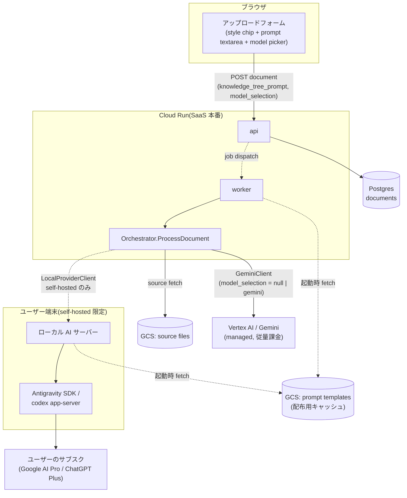
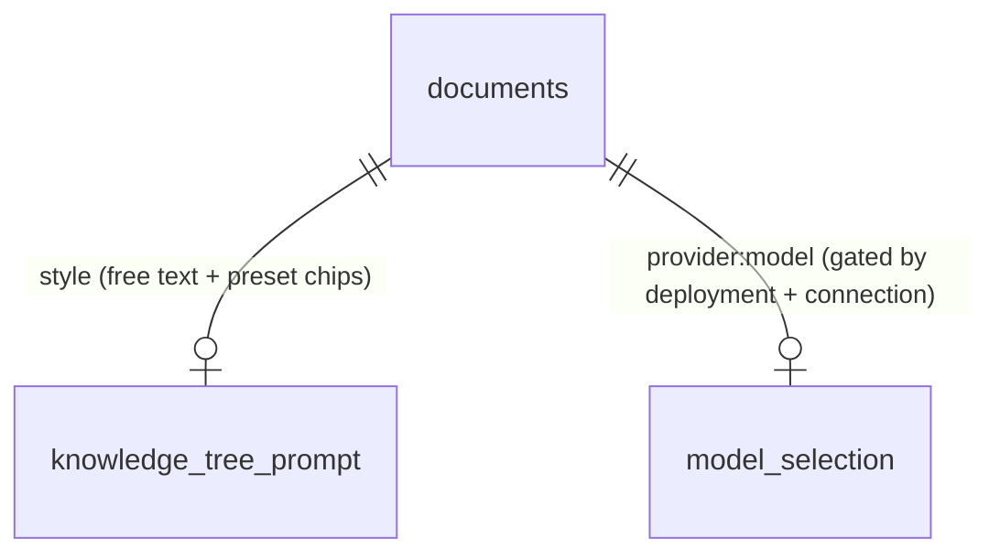
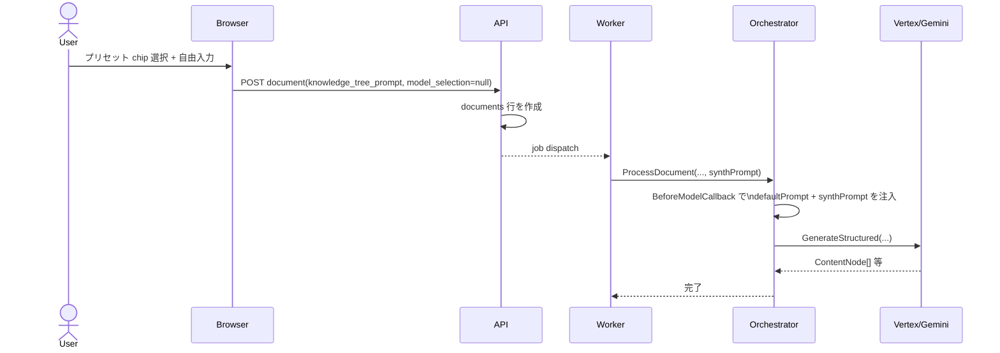
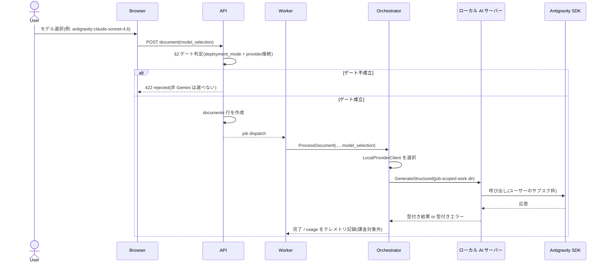
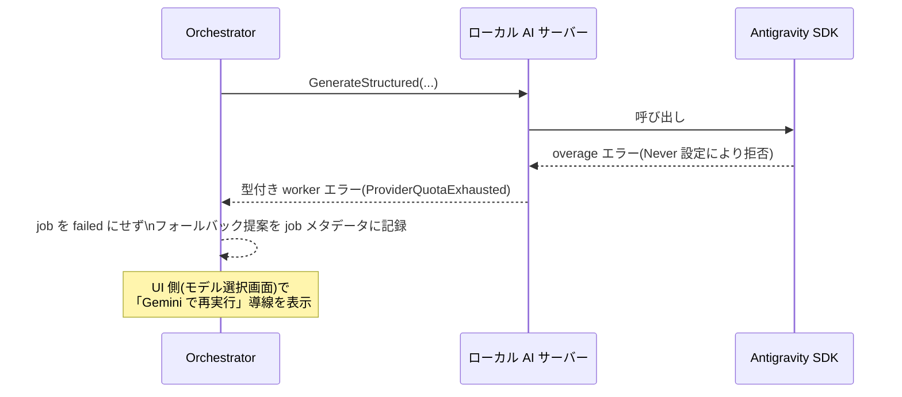
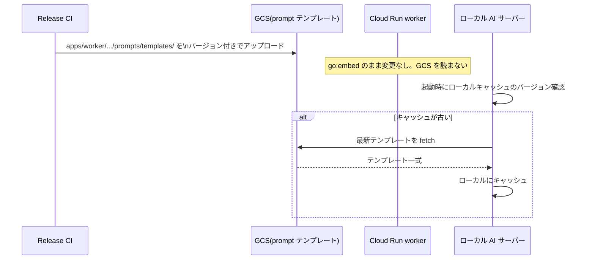

# System Design: モデル選択 & スタイル選択(ナレッジツリー生成)

[knowledge-tree-generation-spec.md](../core-domain/knowledge-tree-generation-spec.md) と
[local-llm-provider.md](../improvements/local-llm-provider.md) で決めた2つの機能
(スタイルプリセット選択・モデル選択)を、**同じアップロードフォーム・同じパイプライン**に
統合するときの実装設計。両ドキュメントの決定事項をそのまま前提にする。

## 0. スコープ

対象は **document upload → knowledge tree generation job**(Cloud Run worker が非同期に処理する
パイプライン)のみ。[paper-native-llm-interaction.md](../improvements/paper-native-llm-interaction.md)
が扱う対話(chat/dialogue)パイプラインは対象外 ── そちらは同期的にブラウザから呼ばれる別経路で、
本ドキュメントの「デプロイ形態と有効化されるモデル」の結論がそのまま当てはまらない(§2 参照)。

---

## 1. コンポーネント図



実線 = 本番 SaaS で常に通る経路。破線 = self-hosted 配備でのみ有効になる経路(§2)。

---

## 2. デプロイ形態と有効化されるモデルの対応(重要な訂正)

[local-llm-provider.md](../improvements/local-llm-provider.md) の Phase 5 は
「Antigravity/Codex 系のモデルは Phase 4 の provider 接続が確立している場合のみ選択肢に現れる」
とだけ書いたが、これは **必要条件であって十分条件ではない**。ここで訂正する。

Cloud Run 上の worker は Google のデータセンターで動くプロセスであり、ユーザーの端末で待ち受ける
`http://127.0.0.1:PORT` のローカル AI サーバーに **ネットワーク的に到達できない**。したがって:

- 配備形態 (a)(worker 内 provider seam)が成立するのは、worker とローカル AI サーバーが
  **同じホスト上にある場合のみ** ── つまり Synthify 自体を self-hosted で動かしているとき。
- Cloud Run 上で動く SaaS 本番の worker は、ユーザーが何を選ぼうと Antigravity/Codex に
  到達する手段がない。

Phase 4 の「provider 接続」(ユーザー/デバイス単位でどの provider が使えるか)は
**あくまで self-hosted インスタンス内でのユーザー識別**の話であり、SaaS 本番でこの機能を
有効化するかどうかとは別の軸。両方を満たして初めてローカル provider が選択肢に出る。

### ゲート条件(両方 true で初めて非 Gemini モデルが選択肢に出る)

| # | 条件 | 判定場所 | 既定値 |
|---|---|---|---|
| 1 | インスタンスが self-hosted 配備である(`DEPLOYMENT_MODE=self-hosted`。SaaS 本番/staging では常に unset) | worker 起動時、環境変数 | SaaS: 無効固定 |
| 2 | そのユーザー/デバイスに provider 接続がある(Phase 4) | API、リクエスト単位 | 未接続なら無効 |

この対応表を [Product boundary](../improvements/local-llm-provider.md#product-boundary) の表と
突き合わせると一致する: 「Synthify Personal / local」だけが Supported PoC target であり、
「Public multi-user Synthify Cloud」は managed provider(Gemini/Vertex)固定。

**UI 側の選択肢生成もこの2条件を両方クエリしてから組み立てる**(条件1を満たさない環境では
条件2の provider 接続 UI 自体を表示しない)。

---

## 3. データモデル

`documents` テーブルへの追加(両機能で共通、カラムは独立):

```sql
ALTER TABLE documents
  ADD COLUMN knowledge_tree_prompt TEXT NULL,  -- スタイル指定。chip 追記 + 自由入力
  ADD COLUMN model_selection       TEXT NULL;  -- 例: "gemini" (既定) | "antigravity:claude-sonnet-4.6"
                                                 --     | "antigravity:gpt-oss-120b" | "codex:gpt-5"
                                                 -- NULL は LLM_PROVIDER の既定値にフォールバック
```

`model_selection` に非 Gemini 値を書き込めるのは §2 のゲートを両方満たしたリクエストのみ。
API はゲート未達のリクエストで非 Gemini 値が来たら **保存前に拒否する**(UI 側の出し分けは
このガードの代替にならない ── [local-llm-provider.md](../improvements/local-llm-provider.md)
の fail-closed 方針をここでも維持する)。



---

## 4. シーケンス

### 4.1 通常経路(Gemini、スタイル指定あり)



### 4.2 モデル選択: ローカル provider 経路(self-hosted 限定、§2 のゲート成立時のみ)



### 4.3 overage 枯渇時のフォールバック



### 4.4 プロンプトテンプレート配布(GCS)



---

## 5. Fail-closed ガード一覧(集約)

複数ドキュメントに分散していたガード条件をここに集約する。実装時はこの一覧を網羅すること。

| ガード | 場所 | 破ったときの挙動 |
|---|---|---|
| `model_selection` が非 Gemini の場合、`DEPLOYMENT_MODE=self-hosted` が必要 | API(保存前) | 422 で拒否 |
| 非 Gemini の場合、Phase 4 の provider 接続が必要 | API(保存前) | 422 で拒否 |
| production/staging では `LLM_PROVIDER` は `gemini` 以外を worker 起動時に拒否 | worker 起動時 | 起動失敗(fail closed) |
| provider の認証情報・認証ファイルはブラウザに送らない | ローカル AI サーバー | 該当データを応答に含めない |
| ローカル provider の job 作業ディレクトリはユーザー/workspace 間で再利用しない | ローカル AI サーバー | job ごとに新規ディレクトリ、確実に削除 |
| `DELETE_NODE` 相当の破壊的操作は provider に発行させない(将来の agent runtime 置換時) | tool schema | スコープから除外 |

---

## 6. テスト戦略

層ごとに何を検証するか。既存の CI レイヤ構成(unit → integration → e2e/nightly)に合わせる。

| 層 | 対象 | ツール | 既存の慣行 |
|---|---|---|---|
| unit(Go) | プロンプト注入、ゲート判定ロジック、fake transport | `go test`、テーブル駆動、`*_test.go` を対象コードと同じパッケージに置く | `apps/worker/pkg/worker/*_test.go` と同じ配置 |
| API/統合 | バリデーション、fail-closed の 422 応答 | Go の httptest、実 DB(sqlc) | `apps/api/internal/handler/*_test.go` と同じ形 |
| eval | 生成品質の比較(スタイル差分・モデル差分) | 既存 eval runner の case/fixture | [llm-eval-runner-contract.md](../contracts/llm-eval-runner-contract.md) |
| e2e | UI 操作 → 実際の状態遷移 | Playwright、video 記録 | [e2e-test-expansion.md](../../issues/tickets/e2e-test-expansion.md) の方針(`waitForTimeout` 禁止、表示状態か API/Firestore の完了条件を待つ) |
| ローカル限定 integration | self-hosted 配備・ローカル provider 呼び出し | 環境変数ガード付き `go test`(CI では通常スキップ) | [local-llm-provider.md「最初の実装 PR」](../improvements/local-llm-provider.md#最初の実装-pr)で既に方針化済み |

### 6.1 スタイルプリセット(実装可能。今すぐ着手できる)

- **unit**: `BeforeModelCallback` が `defaultPrompt` の後に `userPrompt` を連結すること。
  `userPrompt` が空文字のときは省略されること(末尾に余計な改行が残らないことも含む)。
  fake `llm.Client` を渡して最終 `systemInstruction` 文字列を assert する。
- **API/統合**: `knowledge_tree_prompt` が上限文字数(暫定 2000)を超えたら 400。空文字・NULL は許可。
  プリセット chip が生成する文字列と自由入力の連結順(chip 追記 → 手動編集)が壊れていないこと。
- **migration**: up/down が両方通ることを CI で確認(既存の migration テストジョブに乗せる)。
- **eval**: 同一ソースドキュメントに対して「プロンプトなし」と「プリセット適用」の 2 case を
  eval runner に追加し、report を目視比較する(`<ul>` 比率、item 数など)。**この段階では自動 assert
  にはしない** ── 既存 eval runner は品質比較のためのレポートツールであり、pass/fail ゲートでは
  ない位置づけ([llm-eval-runner-contract.md](../contracts/llm-eval-runner-contract.md) と同じ扱い)。
- **e2e(Playwright、video 記録)**: chip をクリック → textarea に指示文が追記される →
  アップロード → 生成完了 → 結果に指示が反映されている(例:「散文で」chip を押した後の
  出力に `<ul>` が現れないこと)ところまでを 1 本のスペックで通す。video を保存して
  レビュー用に残す。

### 6.2 モデル選択(Phase 1-5 が揃うまで段階的)

- **Phase 1(provider seam)**: doc に既述の通り、fake transport による unit test と、
  環境変数でガードしたローカル限定 integration test。production の起動テストは
  「`LLM_PROVIDER=antigravity` を production 設定で渡すと起動失敗する」ことを assert する
  ネガティブテストを追加する(fail-closed の回帰防止)。
- **Phase 5(ゲート)**: §5 の fail-closed ガード表をそのままテストマトリクスにする。
  特に「Phase 4 の provider 接続だけでは不十分」という訂正ポイントは重点的に:

  | `DEPLOYMENT_MODE` | provider 接続 | `model_selection` | 期待結果 |
  |---|---|---|---|
  | unset(SaaS 既定) | なし | `antigravity:*` | 422 |
  | unset(SaaS 既定) | **あり** | `antigravity:*` | **422**(ここが訂正前は抜けていた) |
  | `self-hosted` | なし | `antigravity:*` | 422 |
  | `self-hosted` | あり | `antigravity:*` | 200 |
  | 任意 | 任意 | `null` または `gemini` | 200(既存経路の回帰なし) |

- **eval(Phase 6)**: モデル別に report を分けて記録し、構造化出力の妥当性・grounding・
  tool 選択精度を Gemini と比較する。既存 eval runner の case に `model` 軸を追加する形。
- **e2e(Playwright、video 記録)**: `DEPLOYMENT_MODE` / provider 接続状態を変えた 2〜3 パターンで
  ピッカーの選択肢が変わることを確認する。self-hosted 系のケースは通常の PR CI では動かせない
  ため、nightly/manual と同じ扱いで別ジョブに分離する。

## 7. PR 分割と受け入れ基準

このリポジトリで実際にマージされてきた PR(例: #42, #44)は **1 PR = 1 つの懸念**で、
本文に「何が壊れていたか / なぜ / どう直したか / どう検証したか」を書く形が定着している。
この機能もそれに合わせて分割する。

### 7.1 スタイルプリセット(依存順)

1. **migration**: `documents.knowledge_tree_prompt` カラム追加のみ。振る舞い変更なし。
   受け入れ基準: up/down が通る、既存テストに影響なし。
2. **API**: アップロード時に `knowledge_tree_prompt` を受け取り保存する。まだ生成には使わない
   (dark launch)。受け入れ基準: 6.1 の API/統合テスト。
3. **worker**: `ProcessDocument` に `synthPrompt` を追加し `BeforeModelCallback` で注入する。
   受け入れ基準: 6.1 の unit test。この時点で機能として有効になる。
4. **eval fixture**: default プロンプトとプリセット適用の比較 case を追加。振る舞い変更なし、
   レビュー用の report のみ。
5. **UI**: chip 行 + textarea をアップロードフォームに追加、Playwright e2e(video 付き)。
   このPRで初めてユーザーから触れる状態になる。

各 PR の本文には検証コマンドと出力(またはその要約)を書く ── #42 の "Verified under the exact
condition that broke stage" と同じ粒度。

### 7.2 モデル選択(Phase 単位。[local-llm-provider.md](../improvements/local-llm-provider.md) の
Phase 構成をそのまま PR 粒度の目安にする)

- Phase 1 は doc の「最初の実装 PR」節が既に意図的に小さく分割済み ── それに従う。
- Phase 5(ゲート)は 1 PR に収める: API 側のゲート判定 + §5 のテストマトリクス全行。
  UI 側の選択肢出し分けは同じ PR に含めるか直後の別 PR にするかは実装時の分量で判断してよいが、
  **ゲート判定(API 側)が UI より先に、必ず同じ PR かそれより前に入ること**
  (UI だけ先に出すと、選択肢を絞っただけで安全だと誤認するリスクがある)。
- 各 Phase の PR 本文には、そのフェーズの「PoC の受け入れ条件」(doc 末尾)のうち該当する項目を
  検証結果として書く。

PR 本文に Co-Authored-By トレーラーは付けない(このリポジトリでの合意事項)。

## 8. 未解決 / 要検証

本ドキュメントでは解決していない、[local-llm-provider.md の「要検証」](../improvements/local-llm-provider.md#要検証実装時に確認設計変更のトリガーになりうる)節を参照:

- `conversation_id` が実際に Google サーバー側で resume できるか
- overage `Never` 設定時に SDK が返すエラーの実際の形

[knowledge-tree-generation-spec.md の「未決事項」](../core-domain/knowledge-tree-generation-spec.md)も参照(文字数上限・多言語対応・プリセット一覧の運用)。

---

## 9. 関連

- [knowledge-tree-generation-spec.md](../core-domain/knowledge-tree-generation-spec.md) — スタイルプリセットの詳細仕様
- [local-llm-provider.md](../improvements/local-llm-provider.md) — provider seam・配備形態・Phase 計画
- [paper-native-llm-interaction.md](../improvements/paper-native-llm-interaction.md) — 対話パイプライン(本ドキュメントのスコープ外)
