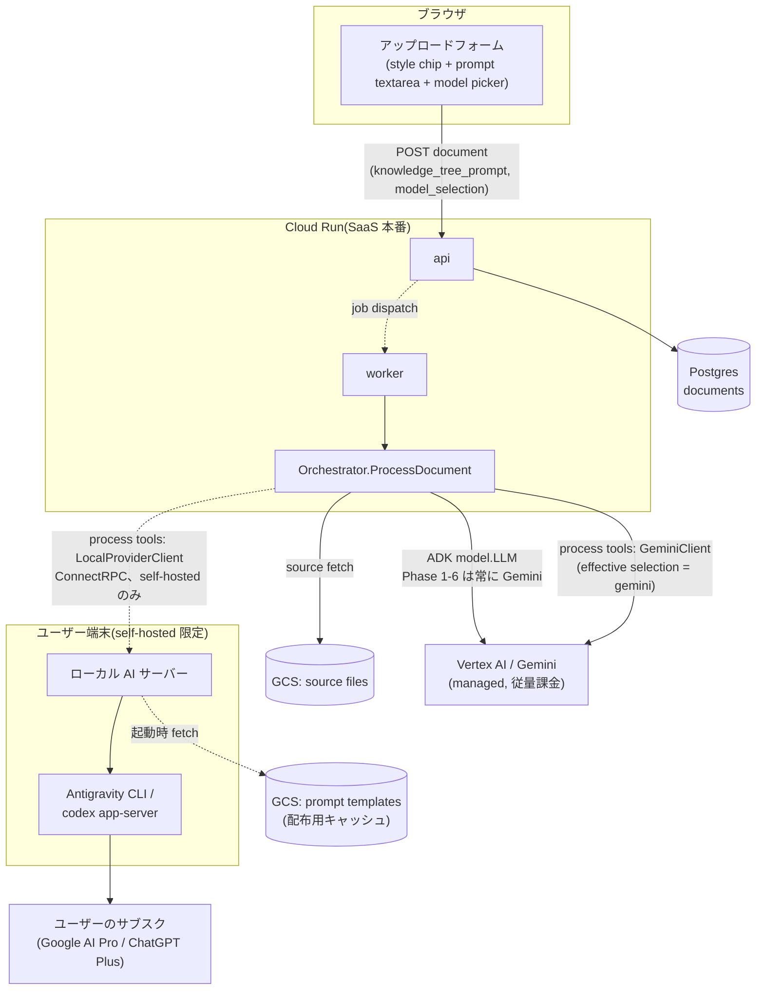
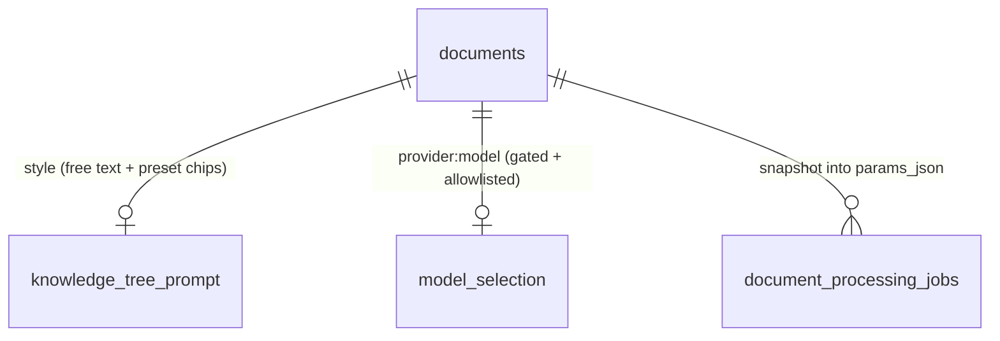
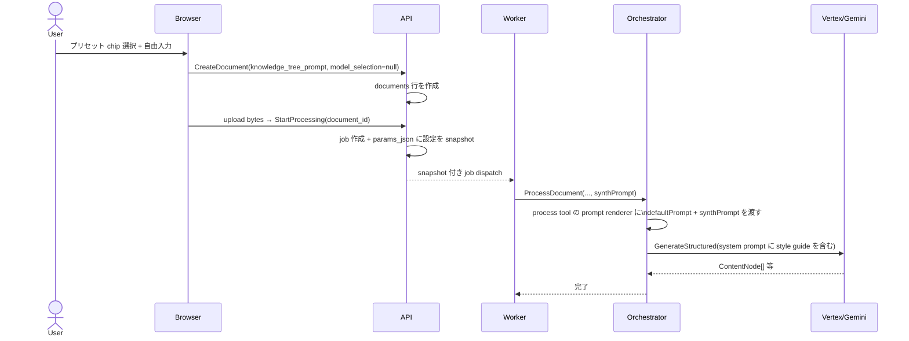
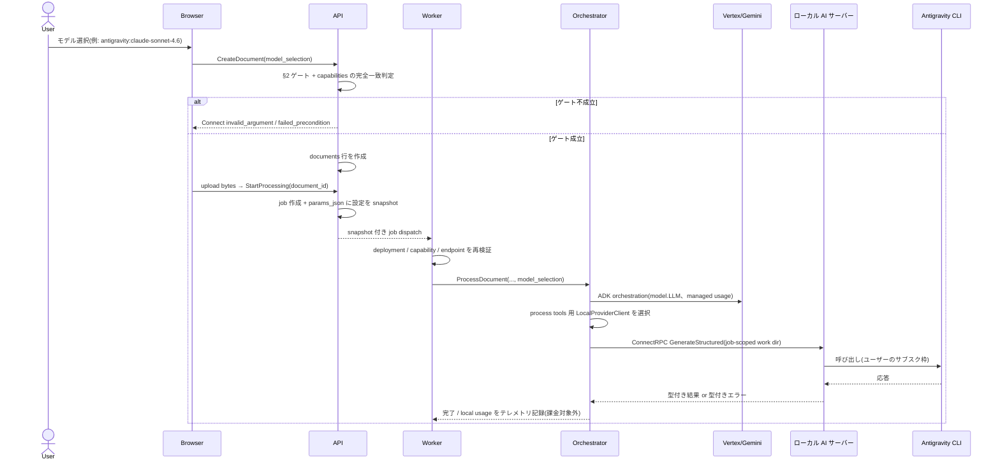
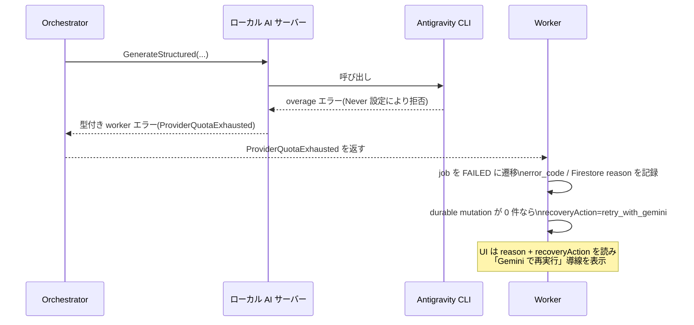
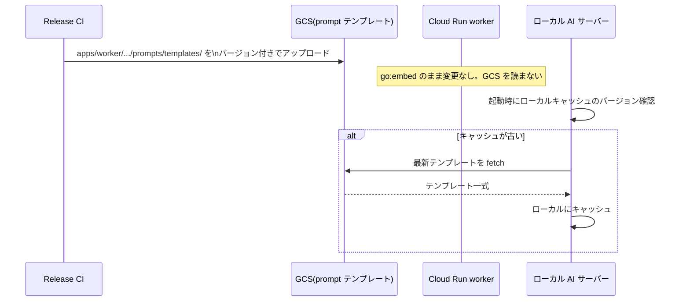

# System Design: モデル選択 & スタイル選択(ナレッジツリー生成)

[knowledge-tree-generation-spec.md](../core-domain/knowledge-tree-generation-spec.md) と
[local-llm-provider.md](../improvements/local-llm-provider.md) で決めた2つの機能
(スタイルプリセット選択・モデル選択)を、**同じアップロードフォーム・同じパイプライン**に
統合するときの実装設計。非同期 worker からユーザー端末の localhost へは到達できないため、
[local-llm-provider.md](../improvements/local-llm-provider.md) のブラウザ + ローカル AI サーバー案を
そのまま適用せず、本パイプラインで成立する範囲を §2 で明示する。

## 0. スコープ

対象は **document upload → knowledge tree generation job**(Cloud Run worker が非同期に処理する
パイプライン)のみ。[paper-native-llm-interaction.md](../improvements/paper-native-llm-interaction.md)
が扱う対話(chat/dialogue)パイプラインは対象外 ── そちらは同期的にブラウザから呼ばれる別経路で、
本ドキュメントの「デプロイ形態と有効化されるモデル」の結論がそのまま当てはまらない(§2 参照)。

---

## 1. コンポーネント図



実線 = 本番 SaaS で常に通る経路。破線 = self-hosted 配備でのみ有効になる経路(§2)。

---

## 2. デプロイ形態と有効化されるモデルの対応(重要な訂正)

[local-llm-provider.md](../improvements/local-llm-provider.md) の Phase 5 は
「Antigravity/Codex 系のモデルは Phase 4 の provider 接続が確立している場合のみ選択肢に現れる」
とだけ書いたが、これは **必要条件であって十分条件ではない**。ここで訂正する。

Cloud Run 上の worker は Google のデータセンターで動くプロセスであり、ユーザーの端末で待ち受ける
`http://127.0.0.1:PORT` のローカル AI サーバーに **ネットワーク的に到達できない**。したがって:

- 配備形態 (a)(worker 内 provider seam)が成立するのは、worker とローカル AI サーバーが
  **同じ self-hosted 環境にあり、worker から `Check` / `GetCapabilities` RPC が通る場合のみ**。単に Synthify を
  self-hosted で動かしているだけでは十分ではない。
- Cloud Run 上で動く SaaS 本番の worker は、ユーザーが何を選ぼうと Antigravity/Codex に
  到達する手段がない。

[local-llm-provider.md](../improvements/local-llm-provider.md) が第一候補とする配備形態 (b)
(ブラウザ → localhost)は、ブラウザが直接行う同期 LLM 呼び出しには使えるが、worker が非同期に
実行する本パイプラインには使えない。本ドキュメントで扱うローカル provider 経路は
**配備形態 (a) + 完全ローカル配備 (c)** に限定する。

Phase 4 の「provider 接続」(ユーザー/デバイス単位でどの provider が使えるか)は
**あくまで self-hosted インスタンス内でのユーザー識別**の話であり、SaaS 本番でこの機能を
有効化するかどうかとは別の軸。すべてのゲートを満たして初めてローカル provider が選択肢に出る。

### ゲート条件(すべて true で初めて非 Gemini モデルが選択肢に出る)

| # | 条件 | 判定場所 | 既定値 |
|---|---|---|---|
| 1 | インスタンスが self-hosted 配備である(`DEPLOYMENT_MODE=self-hosted`。SaaS 本番/staging では常に unset) | API と worker の起動時、同一の環境設定 | SaaS: 無効固定 |
| 2 | そのユーザー/デバイスに provider 接続がある(Phase 4) | API、リクエスト単位 | 未接続なら無効 |
| 3 | worker から設定済み local provider の `Check` / `GetCapabilities` RPC が成功している | API は `WorkerService` の capabilities RPC 経由、worker は実行直前 | 到達不能・非互換なら無効 |

この対応表を [Product boundary](../improvements/local-llm-provider.md#product-boundary) の表と
突き合わせると一致する: 「Synthify Personal / local」だけが Supported PoC target であり、
「Public multi-user Synthify Cloud」は managed provider(Gemini/Vertex)固定。

**UI 側の選択肢生成も API の capabilities 応答から組み立てる**(条件1を満たさない環境では
provider 接続 UI 自体を表示しない)。ブラウザが環境変数や認証情報を直接取得して判定してはならない。

---

## 3. データモデル

`documents` テーブルへの追加(両機能で共通、カラムは独立):

```sql
ALTER TABLE documents
  ADD COLUMN knowledge_tree_prompt TEXT NULL,  -- スタイル指定。chip 追記 + 自由入力
  ADD COLUMN model_selection       TEXT NULL;  -- 例: "gemini" (既定) | "antigravity:claude-sonnet-4.6"
                                                 --     | "antigravity:gpt-oss-120b" | "codex:gpt-5"
                                                 -- NULL は LLM_PROVIDER の既定値にフォールバック
```

`model_selection` に非 Gemini 値を書き込めるのは §2 のゲートをすべて満たしたリクエストのみ。
API はゲート未達のリクエストで非 Gemini 値が来たら **保存前に拒否する**(UI 側の出し分けは
このガードの代替にならない ── [local-llm-provider.md](../improvements/local-llm-provider.md)
の fail-closed 方針をここでも維持する)。

`documents` の2カラムはアップロードフォームの既定値を保持する場所であり、実行時の正本ではない。
`StartProcessing` が job を作成するとき、prompt の NULL は空文字へ、model の NULL はその時点の
deployment 既定値へ解決してから `document_processing_jobs.params_json` に保存する。その job の
再試行・resume・eval は必ずこの immutable snapshot を読み、後の環境変数変更で provider が
変わらないようにする。

```json
{
  "schema_version": 1,
  "knowledge_tree_prompt": "...",
  "requested_model_selection": "",
  "effective_model_selection": "gemini"
}
```

dispatch payload は設定値を複製せず `job_id` を運び、worker が Postgres の job snapshot を読む。
これにより queue payload と DB の不一致を作らず、同じ document を別設定で再処理しても、過去 job が
実際に使った設定を監査できる。

`model_selection` は自由な provider/model 文字列として扱わない。API は local provider の
capabilities 応答が返した完全一致の値だけを許可し、未対応 provider/model、長すぎる値、形式不正を
`invalid_argument` で拒否する。worker も実行直前に同じ検証を行い、API/worker の設定差や DB の
直接変更があっても managed 環境から local provider を呼ばない。

public ConnectRPC field、job snapshot schema、local provider ConnectRPC/Protobuf、Firestore projection、stable error code
の詳細な source of truth は
[model-and-style-selection-contract.md](../contracts/model-and-style-selection-contract.md) とする。



---

## 4. シーケンス

### 4.1 通常経路(Gemini、スタイル指定あり)



### 4.2 モデル選択: ローカル provider 経路(self-hosted 限定、§2 のゲート成立時のみ)



**Phase 1-6 の `model_selection` が切り替えるのは process tools の `llm.Client` のみ**。
ADK orchestrator 自身の `model.LLM` は Gemini のままなので、ローカルモデルを選んだ job も
orchestration の Gemini 呼び出しとその managed usage を含む。UI は「生成ツールのモデル」と表示し、
local usage と managed Gemini usage を別々に記録する。job 全体を単一の local provider に切り替える
意味でのモデル選択は、[local-llm-provider.md](../improvements/local-llm-provider.md) Phase 7 の
agent runtime 判断より前には提供しない。

### 4.3 overage 枯渇時のフォールバック



既存の job state machine に新しい待機状態は追加しない。quota 枯渇は retryable ではない
**型付き terminal failure** とし、Job API に安定した `error_code` を追加する(表示文言の解析で
分岐しない)。Firestore は既存の `reason` field に同じ code を projection する。再実行は新しい job を
作成し、その job snapshot の `effective_model_selection` を `gemini` に override する。ただし
`retry_with_gemini` は durable mutation がない場合だけ発行し、部分的に tree を変更した job には
自動 retry を提案しない。失敗した元 job の snapshot は変更しない。

### 4.4 プロンプトテンプレート配布(GCS)



---

## 5. Fail-closed ガード一覧(集約)

複数ドキュメントに分散していたガード条件をここに集約する。実装時はこの一覧を網羅すること。

| ガード | 場所 | 破ったときの挙動 |
|---|---|---|
| `model_selection` の形式・長さが妥当で、capabilities の完全一致 allowlist に含まれる | API(保存前)、worker(実行直前) | `invalid_argument` / job failed |
| `model_selection` が非 Gemini の場合、`DEPLOYMENT_MODE=self-hosted` が必要 | API(保存前)、worker(実行直前) | `failed_precondition` / job failed |
| 非 Gemini の場合、Phase 4 の provider 接続が必要 | API(保存前)、worker(実行直前) | `failed_precondition` / job failed |
| 非 Gemini の場合、worker から local provider の `Check` / `GetCapabilities` RPC が通る | API は `WorkerService` 経由、worker は実行直前 | 選択肢から除外 / job failed |
| production/staging では `LLM_PROVIDER` は `gemini` 以外を worker 起動時に拒否 | worker 起動時 | 起動失敗(fail closed) |
| job 実行時の prompt/model は `document_processing_jobs.params_json` の snapshot を使う | API(job 作成時)、worker | snapshot 不在・不一致なら job failed |
| local provider の全 RPC は owner-only file で共有した bearer token を要求する | Worker/ローカル AI サーバーの Connect interceptor | missing/invalid は `unauthenticated` |
| provider の認証情報・認証ファイルはブラウザに送らない | ローカル AI サーバー | 該当データを応答に含めない |
| ローカル provider の job 作業ディレクトリはユーザー/workspace 間で再利用しない | ローカル AI サーバー | job ごとに新規ディレクトリ、確実に削除 |
| `DELETE_NODE` 相当の破壊的操作は provider に発行させない(将来の agent runtime 置換時) | tool schema | スコープから除外 |

---

## 6. テスト戦略

層ごとに何を検証するか。既存の CI レイヤ構成(unit → integration → e2e/nightly)に合わせる。

| 層 | 対象 | ツール | 既存の慣行 |
|---|---|---|---|
| unit(Go) | プロンプト注入、ゲート判定ロジック、fake transport | `go test`、テーブル駆動、`*_test.go` を対象コードと同じパッケージに置く | `apps/worker/pkg/worker/*_test.go` と同じ配置 |
| contract | Public/local-provider Proto additive compatibility、Go/Python/TS generated code 同期、job params version、Firestore schema/consumer | `buf lint/build/generate`、generated Go client ↔ Python fake server、JSON Schema、Go/Vitest contract test | [model-and-style-selection-contract.md](../contracts/model-and-style-selection-contract.md) §8 |
| API/統合 | バリデーション、Connect の fail-closed 応答 | Go の httptest、実 DB(sqlc) | `apps/api/internal/handler/*_test.go` と同じ形 |
| race | job 間の prompt/model/provider state 隔離 | 対象 package の `go test -race` | feature 変更 PR と release 前に必須 |
| eval | 生成品質の比較(スタイル差分・モデル差分) | 既存 eval runner の case/fixture | [llm-eval-runner-contract.md](../contracts/llm-eval-runner-contract.md) |
| e2e | UI 操作 → 実際の状態遷移 | Playwright、video 記録 | [e2e-test-expansion.md](../../issues/tickets/e2e-test-expansion.md) の方針(`waitForTimeout` 禁止、表示状態か API/Firestore の完了条件を待つ) |
| ローカル限定 integration | self-hosted 配備・ローカル provider 呼び出し | 環境変数ガード付き `go test`(CI では通常スキップ) | [local-llm-provider.md「最初の実装 PR」](../improvements/local-llm-provider.md#最初の実装-pr)で既に方針化済み |

### 6.1 スタイルプリセット(実装可能。今すぐ着手できる)

- **unit**: knowledge-tree の prompt renderer / process tool に `defaultPrompt` と `userPrompt` を渡し、
  direct `llm.Client.GenerateStructured` の `SystemPrompt` にこの順で連結されること。
  `userPrompt` が空文字のときは省略されること(末尾に余計な改行が残らないことも含む)。
  fake `llm.Client` が受け取った最終 `StructuredRequest.SystemPrompt` を assert する。一貫性要件を
  満たすため、brief・critique の direct client request にも同じ style guide が入ることを test する。
- **API/統合**: `knowledge_tree_prompt` が 2000 Unicode code point を超えたら `invalid_argument`。
  空文字・NULL は許可。
  プリセット chip が生成する文字列と自由入力の連結順(chip 追記 → 手動編集)が壊れていないこと。
- **migration**: up/down が両方通ることを CI で確認(既存の migration テストジョブに乗せる)。
- **eval**: 同一ソースドキュメントに対して「プロンプトなし」と「プリセット適用」の 2 case を
  eval runner に追加し、report を目視比較する(`<ul>` 比率、item 数など)。**この段階では自動 assert
  にはしない** ── 既存 eval runner は品質比較のためのレポートツールであり、pass/fail ゲートでは
  ない位置づけ([llm-eval-runner-contract.md](../contracts/llm-eval-runner-contract.md) と同じ扱い)。
- **e2e(Playwright、video 記録)**: fake LLM を使い、chip をクリック → textarea に指示文が追記される
  → アップロード → job snapshot → 生成完了までを 1 本のスペックで通す。PR E2E では request と
  状態遷移を assert し、「`<ul>` が減る」等の確率的な生成品質は live eval report で比較する。
  video には固定の非機密 fixture prompt だけを映し、diagnostic/log artifact に prompt 本文を残さない。

### 6.2 モデル選択(Phase 1-5 が揃うまで段階的)

- **Phase 1(provider seam)**: doc に既述の通り、fake transport による unit test と、
  環境変数でガードしたローカル限定 integration test。production の起動テストは
  「`LLM_PROVIDER=antigravity` を production 設定で渡すと起動失敗する」ことを assert する
  ネガティブテストを追加する(fail-closed の回帰防止)。
- **Phase 5(ゲート)**: §5 の fail-closed ガード表をそのままテストマトリクスにする。
  特に「Phase 4 の provider 接続だけでは不十分」という訂正ポイントは重点的に:

  | `DEPLOYMENT_MODE` | provider 接続 | `model_selection` | 期待結果 |
  |---|---|---|---|
  | unset(SaaS 既定) | なし | `antigravity:*` | `failed_precondition` |
  | unset(SaaS 既定) | **あり** | `antigravity:*` | **`failed_precondition`**(ここが訂正前は抜けていた) |
  | `self-hosted` | なし | `antigravity:*` | `failed_precondition` |
  | `self-hosted` | あり | `antigravity:*` | success |
  | 任意 | 任意 | `null` または `gemini` | success(既存経路の回帰なし) |

  `self-hosted` / 接続あり / `antigravity:*` の success 行は worker からの
  `Check` / `GetCapabilities` RPC 成功かつ model が
  capabilities allowlist に含まれることを前提とする。形式不正・未対応 model は deployment/接続状態に
  かかわらず `invalid_argument`。

- **eval(Phase 6)**: モデル別に report を分けて記録し、process-tool の構造化出力の妥当性・grounding
  を Gemini と比較する。既存 eval runner は ADK を通らないため tool 選択精度は測れない。
  case に `style_prompt`、report に provider / effective model / selection scope / prompt hash を追加する。
  ADK tool selection は将来の agent eval contract の対象とする。
- **e2e(Playwright、video 記録)**: `DEPLOYMENT_MODE` / provider 接続状態を変えた 2〜3 パターンで
  ピッカーの選択肢が変わることを確認する。fake capabilities/local provider を使う UI・状態遷移は
  PR CI、実際の認証済み self-hosted provider を使うケースだけを nightly/manual の別ジョブに分離する。

## 7. PR 分割と受け入れ基準

このリポジトリで実際にマージされてきた PR(例: #42, #44)は **1 PR = 1 つの懸念**で、
本文に「何が壊れていたか / なぜ / どう直したか / どう検証したか」を書く形が定着している。
この機能もそれに合わせて分割する。

### 7.1 スタイルプリセット(依存順)

1. **migration**: `documents.knowledge_tree_prompt` カラム追加のみ。振る舞い変更なし。
   受け入れ基準: up/down が通る、既存テストに影響なし。
2. **API**: アップロード時に `knowledge_tree_prompt` を受け取り保存し、`StartProcessing` 時に
   `document_processing_jobs.params_json` へ snapshot する。まだ生成には使わない(dark launch)。
   受け入れ基準: 6.1 の API/統合テスト、および再処理しても過去 job の snapshot が変わらないこと。
3. **worker**: snapshot の `synthPrompt` を `ProcessDocument` へ渡し、knowledge-tree prompt renderer
   から direct `llm.Client` request の system prompt に注入する。brief・critique の各 request にも
   同じ style guide を明示的に渡す。受け入れ基準: 6.1 の unit test。
   この時点で機能として有効になる。
4. **eval fixture**: default プロンプトとプリセット適用の比較 case を追加。振る舞い変更なし、
   レビュー用の report のみ。
5. **UI**: chip 行 + textarea をアップロードフォームに追加、Playwright e2e(video 付き)。
   このPRで初めてユーザーから触れる状態になる。

各 PR の本文には検証コマンドと出力(またはその要約)を書く ── #42 の "Verified under the exact
condition that broke stage" と同じ粒度。

### 7.2 モデル選択(Phase 単位。[local-llm-provider.md](../improvements/local-llm-provider.md) の
Phase 構成をそのまま PR 粒度の目安にする)

- Phase 1 は doc の「最初の実装 PR」節が既に意図的に小さく分割済み ── それに従う。
- Phase 5(ゲート)は 1 PR に収める: capabilities API、API 側の保存前ゲート、job snapshot、worker の
  実行直前再検証、typed `error_code` + §5 のテストマトリクス全行。
  UI 側の選択肢出し分けは同じ PR に含めるか直後の別 PR にするかは実装時の分量で判断してよいが、
  **ゲート判定(API 側)が UI より先に、必ず同じ PR かそれより前に入ること**
  (UI だけ先に出すと、選択肢を絞っただけで安全だと誤認するリスクがある)。
- 各 Phase の PR 本文には、そのフェーズの「PoC の受け入れ条件」(doc 末尾)のうち該当する項目を
  検証結果として書く。

### 7.3 Contract / test gate

[model-and-style-selection-contract.md](../contracts/model-and-style-selection-contract.md) §8 を test policy の
source of truth とする。PR gate は fake provider/LLM を使う deterministic test に限定し、live Gemini
eval は release evidence、ユーザーの認証済み local provider integration は local-provider release gate
として scheduled/manual で実行する。関連する `*.matrix.md` に contract branch の OK/PARTIAL/GAP を
記録し、必須 branch の GAP が残る間は feature flag を有効化しない。

## 8. 未解決 / 要検証

本ドキュメントでは解決していない、[local-llm-provider.md の「要検証」](../improvements/local-llm-provider.md#要検証実装時に確認設計変更のトリガーになりうる)節を参照:

- overage `Never` 設定時に CLI が返す status/error の実際の形
- `agy` 内部 retry の実挙動と抑止可否

[knowledge-tree-generation-spec.md の「未決事項」](../core-domain/knowledge-tree-generation-spec.md)も参照
(多言語対応・プリセット一覧の運用)。

---

## 9. 関連

- [knowledge-tree-generation-spec.md](../core-domain/knowledge-tree-generation-spec.md) — スタイルプリセットの詳細仕様
- [local-llm-provider.md](../improvements/local-llm-provider.md) — provider seam・配備形態・Phase 計画
- [model-and-style-selection-contract.md](../contracts/model-and-style-selection-contract.md) — API・snapshot・provider・job status・test policy
- [paper-native-llm-interaction.md](../improvements/paper-native-llm-interaction.md) — 対話パイプライン(本ドキュメントのスコープ外)
