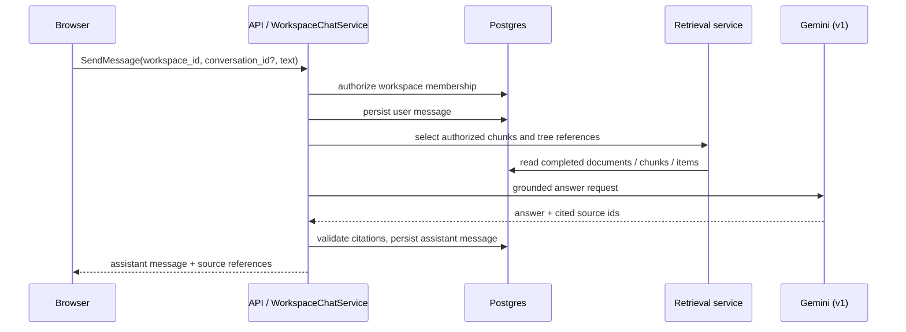

# System Design: Workspace Chat

ワークスペースのアップロード領域の下に置く、保存済みドキュメントとナレッジツリーを対象にした
**read-only の質問応答**機能の設計。ユーザーが「このワークスペースについて聞く」ための経路であり、
document processing job や knowledge tree の更新を行う agent 経路とは分離する。

## 0. Scope

### v1 に含めるもの

- ワークスペース単位の会話一覧とメッセージ履歴
- ユーザーの質問に対する、ワークスペース内 document chunk / tree item を根拠にした回答
- 回答ごとの source citation と paper へのリンク
- 会話・メッセージ・citation の Postgres 永続化
- Gemini による非 streaming の回答
- ワークスペース role に基づく read authorization

### v1 に含めないもの

- tree item、document、dynamic tool、workspace setting の変更
- ファイルが upload / processing 中の内容を根拠にした回答
- ブラウザから local provider に直接つなぐ経路
- チームをまたぐ会話、public share link からの会話
- 画像生成、添付ファイル、音声入力
- 会話からの自動 action 実行

「チャットで答える」と「知識ツリーを更新する」は別 capability である。前者に mutation tool を
与えないことを、prompt ではなく service / repository の依存関係で保証する。

---

## 1. UX

`WorkspacePaper` の upload control の直下に、常に同じ幅で表示する。

```text
[ ファイルをアップロード ]
[ 処理モデル ]

──────────────────────────────────
このワークスペースに質問
  User: この資料の結論は？
  Synthify: …
             [資料名 p. 3] [Knowledge tree: X]

[ このワークスペースについて質問…             送信 ]
```

- 空の workspace では input を disabled にし、「処理済みの資料を追加すると質問できます」と表示する。
- processing 中の document は citation / retrieval の候補から除く。既存の完了済み資料には質問できる。
- 回答生成中は同一 conversation の submit を disabled にし、`停止` を表示する。
- citation は短い source label とし、クリック時に該当 paper または document viewer を開く。
- 最初の質問で conversation を作る。会話タイトルは v1 では「新しい会話」+日時でよく、LLM による自動命名は
  後続 phase にする。

UI は local provider の endpoint、接続状態の詳細、token を表示・保存しない。

---

## 2. Architecture



API owns authorization, grounding context construction, citation validation, and persistence. The model can suggest
citations but cannot create arbitrary source links: API accepts only IDs that were in the retrieval candidate set.

The chat service does not depend on `Worker`, `Orchestrator`, `DynamicToolRepository`, or mutation repositories.
This is the primary structural guard against chat becoming a write-capable agent.

---

## 3. Data model

```sql
CREATE TABLE workspace_chat_conversations (
  conversation_id TEXT PRIMARY KEY,
  workspace_id TEXT NOT NULL REFERENCES workspaces(workspace_id) ON DELETE CASCADE,
  created_by TEXT NOT NULL,
  title TEXT NOT NULL DEFAULT '',
  created_at TIMESTAMPTZ NOT NULL,
  updated_at TIMESTAMPTZ NOT NULL
);

CREATE TABLE workspace_chat_messages (
  message_id TEXT PRIMARY KEY,
  conversation_id TEXT NOT NULL REFERENCES workspace_chat_conversations(conversation_id) ON DELETE CASCADE,
  role TEXT NOT NULL CHECK (role IN ('user', 'assistant')),
  content TEXT NOT NULL,
  model_selection TEXT NOT NULL DEFAULT 'gemini',
  retrieval_snapshot_json JSONB NOT NULL DEFAULT '{}',
  created_at TIMESTAMPTZ NOT NULL
);

CREATE TABLE workspace_chat_message_sources (
  message_id TEXT NOT NULL REFERENCES workspace_chat_messages(message_id) ON DELETE CASCADE,
  ordinal INTEGER NOT NULL,
  document_id TEXT NOT NULL REFERENCES documents(document_id) ON DELETE CASCADE,
  chunk_id TEXT NOT NULL DEFAULT '',
  item_id TEXT NOT NULL DEFAULT '',
  label TEXT NOT NULL,
  PRIMARY KEY (message_id, ordinal)
);
```

`retrieval_snapshot_json` is an internal reproducibility record, not an API response. It contains only bounded source
identifiers, retrieval strategy/version, and effective model selection; it never contains provider credentials or the
raw hidden system prompt. Retention follows the workspace deletion cascade.

Conversation access is workspace access. The creator does not gain a private visibility exception: any current
workspace reader can read its conversations in v1. If private conversations are required later, add an explicit
visibility column and migration rather than inferring it from `created_by`.

---

## 4. Public API contract

The concrete source of truth will be additive messages in
`contracts/connectrpc/synthify/app/v1/workspace_chat.proto`.

```proto
service WorkspaceChatService {
  rpc ListConversations(ListWorkspaceChatConversationsRequest)
      returns (ListWorkspaceChatConversationsResponse);
  rpc ListMessages(ListWorkspaceChatMessagesRequest)
      returns (ListWorkspaceChatMessagesResponse);
  rpc SendMessage(SendWorkspaceChatMessageRequest)
      returns (SendWorkspaceChatMessageResponse);
  rpc CancelMessage(CancelWorkspaceChatMessageRequest)
      returns (CancelWorkspaceChatMessageResponse);
}

message SendWorkspaceChatMessageRequest {
  string workspace_id = 1;
  string conversation_id = 2; // empty creates a conversation
  string text = 3;
}

message WorkspaceChatSource {
  string document_id = 1;
  string chunk_id = 2;
  string item_id = 3;
  string label = 4;
}

message WorkspaceChatMessage {
  string message_id = 1;
  string conversation_id = 2;
  string role = 3;
  string content = 4;
  repeated WorkspaceChatSource sources = 5;
  string model_selection = 6;
  string created_at = 7;
}
```

Rules:

- `text` is valid UTF-8, 1–8,000 Unicode code points; leading/trailing whitespace is preserved except an
  all-whitespace message, which is invalid.
- `workspace_id` requires reader-or-higher membership. `conversation_id`, when present, must belong to that workspace.
- API persists the user message before generation starts. A failed/cancelled assistant turn is represented by a stable
  error state in a separate generation row or an additive message status field; it is not silently omitted.
- `sources` are server-generated. Client input cannot name source ids.
- v1 is unary with a server-side deadline. Streaming is an additive v2 transport change; message persistence semantics
  remain identical.

Error mapping:

| Situation | Connect code | Stable client code |
|---|---|---|
| blank/oversized message; invalid conversation-workspace pair | `invalid_argument` | `invalid_chat_message` |
| no workspace read access | `permission_denied` | `workspace_access_denied` |
| no completed sources | `failed_precondition` | `chat_source_unavailable` |
| generation already active for conversation | `failed_precondition` | `chat_generation_in_progress` |
| cancellation lost race with completed turn | successful idempotent response | — |
| model deadline/provider failure | terminal assistant error | `chat_generation_failed` |

---

## 5. Retrieval and citation policy

1. Fetch only completed documents in the authorized workspace.
2. Retrieve a bounded set of chunk candidates using the existing vector search plus a deterministic lexical fallback.
3. Include a bounded tree summary and source metadata in the model request.
4. Request a structured answer containing `answer` and candidate source IDs.
5. Validate every returned source ID against the candidate set; drop invalid citations.
6. Persist the answer and validated citations atomically.

Initial bounds:

| Limit | v1 value | Reason |
|---|---:|---|
| retrieved chunks | 12 | keeps context and citation checking bounded |
| context text | 24,000 characters | avoids an unbounded prompt cost |
| conversation history | latest 12 messages | avoids replaying the entire conversation |
| active generations per conversation | 1 | preserves ordering and cancellation semantics |
| server generation deadline | 60 seconds | returns a bounded user interaction |

No answer may claim a citation that was not in the retrieval candidate set. An answer with no valid citation is allowed
only when it clearly labels itself as a synthesis of the workspace tree; otherwise API returns a grounded-answer failure
instead of fabricating provenance.

---

## 6. Model and billing policy

v1 uses Gemini only. The document-processing model picker remains scoped to `process_tools`; selecting a local model
there does not change chat.

This deliberate separation avoids coupling a first chat release to local daemon availability, streaming cancellation,
and subscription-provider accounting. Each assistant message records `model_selection="gemini"` so a future choice is
an additive, auditable extension.

Local chat models may be enabled only after all of the following are implemented:

- `GetGenerationCapabilities` returns a `workspace_chat` selection scope in addition to `process_tools`.
- API snapshots the exact effective selection before a turn starts.
- Worker/local-provider cancellation behavior is available for chat turns.
- provider usage and billing policy are explicit for self-hosted and managed deployments.
- concurrent conversations cannot leak selection or retrieval context across requests (`go test -race` coverage).

---

## 7. Security and privacy

- Authorization happens before conversation metadata, messages, chunks, or item labels are read.
- Retrieval queries always include `workspace_id`; source IDs alone are never trusted as scope.
- Chat is read-only by construction: no tool registry, mutation capability, or write repository is injected.
- User text and assistant text are stored as workspace content. They must not be added to ordinary structured logs,
  Firestore status documents, usage events, or error telemetry.
- Raw model prompts, local endpoints, bearer tokens, and provider account identity must never be persisted in chat rows.
- Existing workspace delete semantics must cascade chat rows and citations.

---

## 8. Delivery plan and test policy

### Phase 1 — persisted Gemini Q&A

1. Add migration, SQL queries, domain types, and repository tests.
2. Add additive ConnectRPC service and authorization tests.
3. Implement bounded retrieval and structured citation validation.
4. Add the non-streaming panel below upload with history and source links.

### Phase 2 — cancellation and progress

1. Add a generation state row or status field.
2. Add idempotent `CancelMessage` and a stop button.
3. Show an in-progress assistant bubble and recoverable failure state.

### Phase 3 — streaming and local-model evaluation

1. Add server streaming without changing final persistence semantics.
2. Add a chat-specific capabilities scope and model snapshot.
3. Enable local provider only after provider/cancellation/billing contract tests pass.

Required tests before Phase 1 is complete:

- API authorization matrix: owner/editor/viewer/non-member, cross-workspace conversation IDs, deleted workspace.
- retrieval matrix: empty workspace, processing-only workspace, completed chunks, candidate bound, lexical fallback.
- citation tests: valid source, unknown source, source from another workspace, duplicate ordinal, no-source answer.
- persistence tests: user message is durable before generation; assistant + citations are atomic; deletion cascades.
- UI tests: empty state, send/disable behavior, error/retry state, source link target.
- regression test that chat dependencies expose no mutation methods or dynamic tools.

## 9. Open product decisions

1. Should all workspace readers see the same conversations (recommended v1), or should conversations be private by default?
2. Should citations open a document viewer, a tree paper, or present both when available?
3. What is the retention/export policy for chat content in a shared workspace?
4. When local chat models arrive, should they be per-message or locked for an entire conversation? Per-message snapshots are
   more auditable; a conversation-level default is more convenient.
