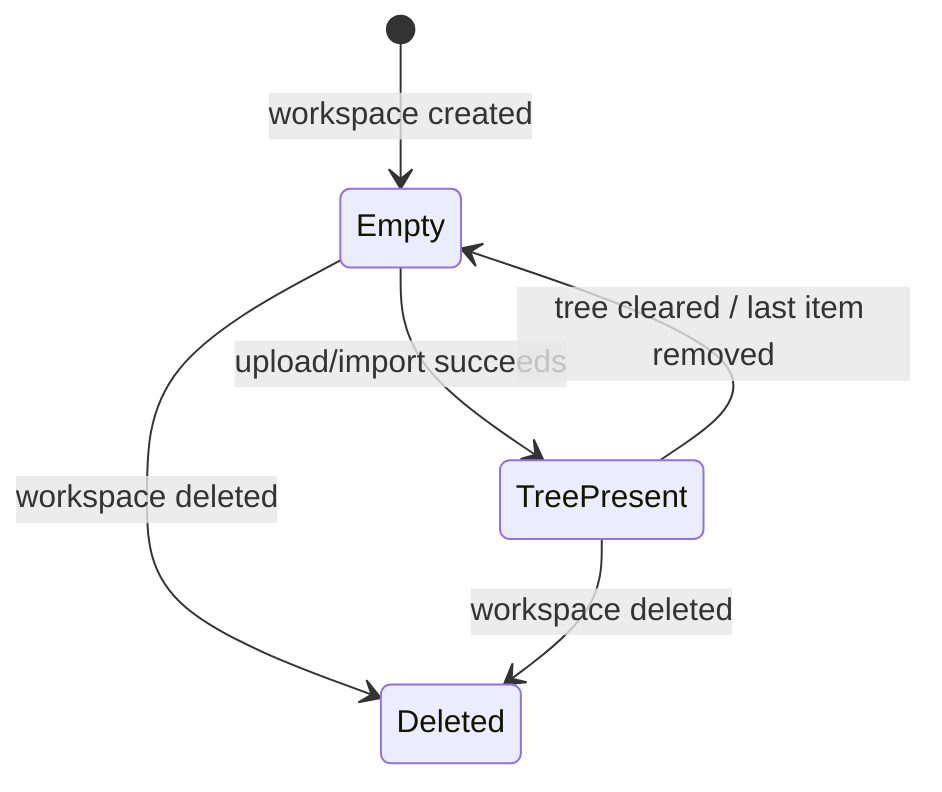

# Workspace Lifecycle Spec

この文書は、Synthify のワークスペースが取りうる状態と、そのときの UI / データのふるまいを定義する。

対象は次の 3 状態である。

- 空の状態
- tree がある状態
- ワークスペースを削除する状態

---

## 1. 基本方針

- ワークスペースは tree の入れ物である
- tree が存在しない、または root item がまだ作られていない場合は「空の状態」とみなす
- 空の状態では、ユーザーに何らかのデータをアップロードするよう促す
- tree がある状態では、tree を閲覧・展開・編集できる
- ワークスペース削除は破壊的操作として扱い、確認を要求する

---

## 2. 状態定義

### 2.1 空の状態

定義:

- `workspace` は存在するが、まだ tree が構築されていない
- もしくは tree はあるが、表示可能な item が 0 件である

UI のふるまい:

- 「データをアップロードしてください」という案内を出す
- 主要アクションは upload / import を優先表示する
- tree 操作はできない、または意味を持たないため非表示にする
- workspace の root 表示は placeholder に留める

期待する文言の例:

- `まずはデータをアップロードしてください`
- `PDF やテキストを追加すると tree が生成されます`

### 2.2 tree がある状態

定義:

- workspace に対して tree が存在する
- 少なくとも 1 件の root item がある、または root から辿れる item 群がある

UI のふるまい:

- tree を通常表示する
- item の展開、選択、フォーカスが可能である
- tree を構成する item は workspace の主表示対象になる

### 2.3 ワークスペース削除

定義:

- workspace を永続データから削除する破壊的操作

期待するふるまい:

- 削除前に確認ダイアログを出す
- 削除対象は workspace 本体だけでなく、その tree と item、関連 provenance を含む
- workspace に紐づく document がある場合は、同時削除または後続の GC 対象として扱う
- 削除後は workspace 一覧から消える
- もし現在表示中の workspace が削除されたら、一覧または空の landing へ戻す

---

## 3. 遷移ルール

### 3.1 空 -> tree あり

- ユーザーがデータをアップロードする
- 解析が成功して root item が生成される
- workspace は tree を持つ状態になる

### 3.2 tree あり -> 空

- 最後の item が削除された
- tree の再生成に失敗した
- tree を初期化した

このときは再び upload 誘導を出す

### 3.3 任意 -> 削除

- ユーザーが workspace を削除する
- 関連データの削除が完了する
- workspace は一覧から消える

---

## 4. データ整合性

- workspace は tree の親である
- tree は item を持つ
- 空の状態では tree が未生成でも許容する
- tree が 0 件になった場合は、空の状態へ戻す
- 削除操作は cascade で扱い、孤立した tree / item を残さない

---

## 5. 実装上の指針

- UI は workspace の状態を `empty` / `tree_present` / `deleted` として扱う
- empty state の primary action は upload にする
- delete action は destructive として強調する
- `tree_present` から `empty` に戻るケースも、同じ空状態 UI を再利用する

---

## 6. 受け入れ基準

- 空の workspace を開くと、upload を促す表示になる
- tree がある workspace を開くと、tree が表示される
- workspace を削除すると、一覧から消える
- 削除後に現在の画面が壊れず、適切な空画面または一覧へ遷移する
