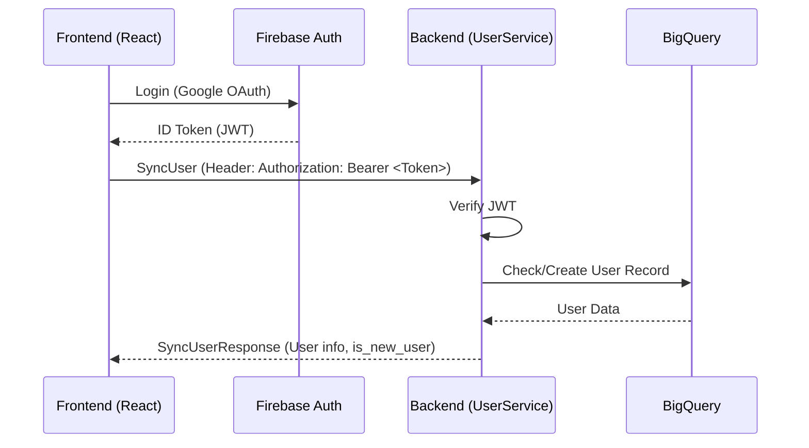
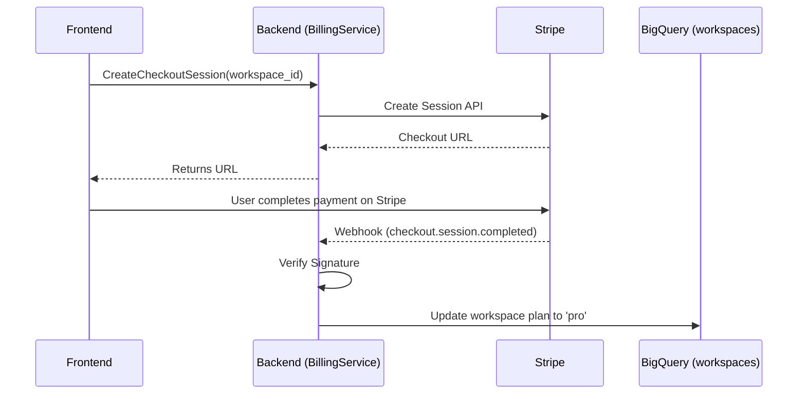
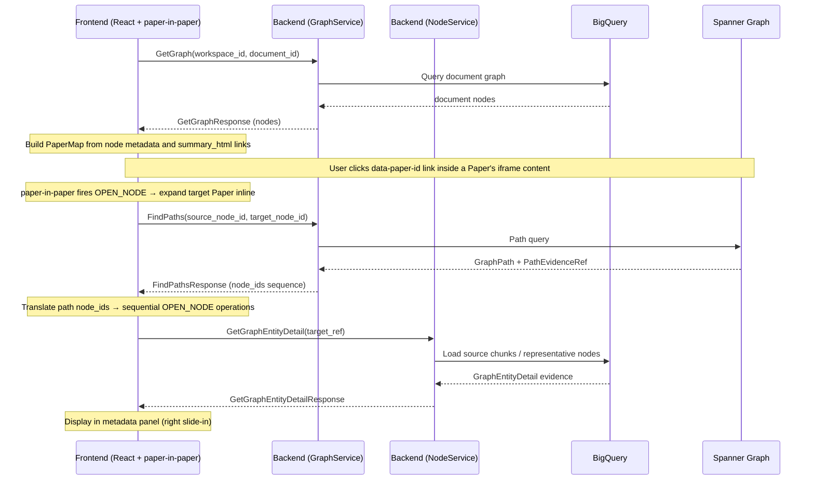
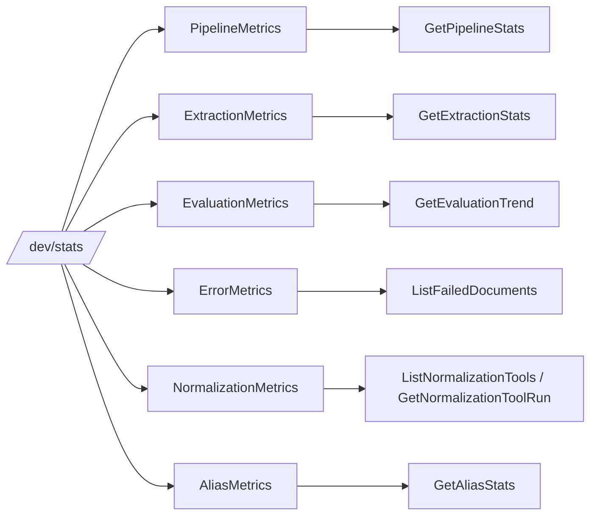

# API Flows and Interactions

This document visualizes the primary interactions between the Frontend, Backend, and external services like Firebase Auth and Stripe.

## 1. Authentication and User Sync

When a user logs in for the first time or returns, the following flow ensures their profile is synchronized.

## 2. Workspace Management & Billing (Stripe)

Upgrading a workspace to the 'Pro' plan involves a redirection to Stripe.

## 3. Interactive Graph Exploration

The core value of the system is the interactive traversal of the knowledge graph via the paper-in-paper UI.

## 4. Monitoring and Metrics Families

`/dev/stats` is organized by metrics family so the UI, RPCs, and stored aggregates use the same vocabulary.

