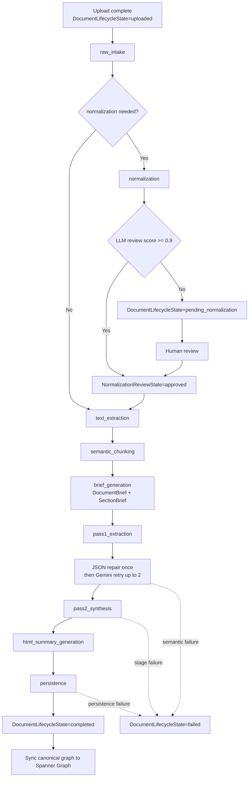
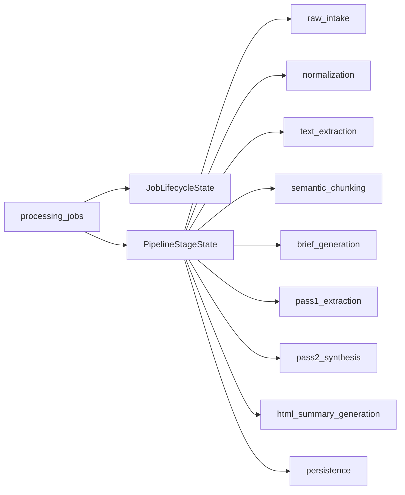

# AI Pipeline Flow

```mermaid
graph TD
    A[Upload complete<br/>DocumentLifecycleState=uploaded] --> B[raw_intake]
    B --> C{normalization needed?}
    C -- No --> D[text_extraction]
    C -- Yes --> N1[normalization]
    N1 --> N2{LLM review score >= 0.9}
    N2 -- Yes --> N3[NormalizationReviewState=approved]
    N2 -- No --> N4[DocumentLifecycleState=pending_normalization]
    N3 --> D
    N4 --> N5[Human review]
    N5 --> N3

    D --> E[semantic_chunking]
    E --> F[brief_generation<br/>DocumentBrief + SectionBrief]
    F --> G[pass1_extraction]
    G --> H[JSON repair once<br/>then Gemini retry up to 2]
    H --> I[pass2_synthesis]
    I --> J[html_summary_generation]
    J --> K[persistence]
    K --> L[DocumentLifecycleState=completed]
    L --> M[Sync canonical graph to Spanner Graph]

    H -. semantic failure .-> X[DocumentLifecycleState=failed]
    I -. stage failure .-> X
    K -. persistence failure .-> X
```

```mermaid
flowchart LR
    A[processing_jobs] --> B[JobLifecycleState]
    A --> C[PipelineStageState]
    C --> C1[raw_intake]
    C --> C2[normalization]
    C --> C3[text_extraction]
    C --> C4[semantic_chunking]
    C --> C5[brief_generation]
    C --> C6[pass1_extraction]
    C --> C7[pass2_synthesis]
    C --> C8[html_summary_generation]
    C --> C9[persistence]
```
