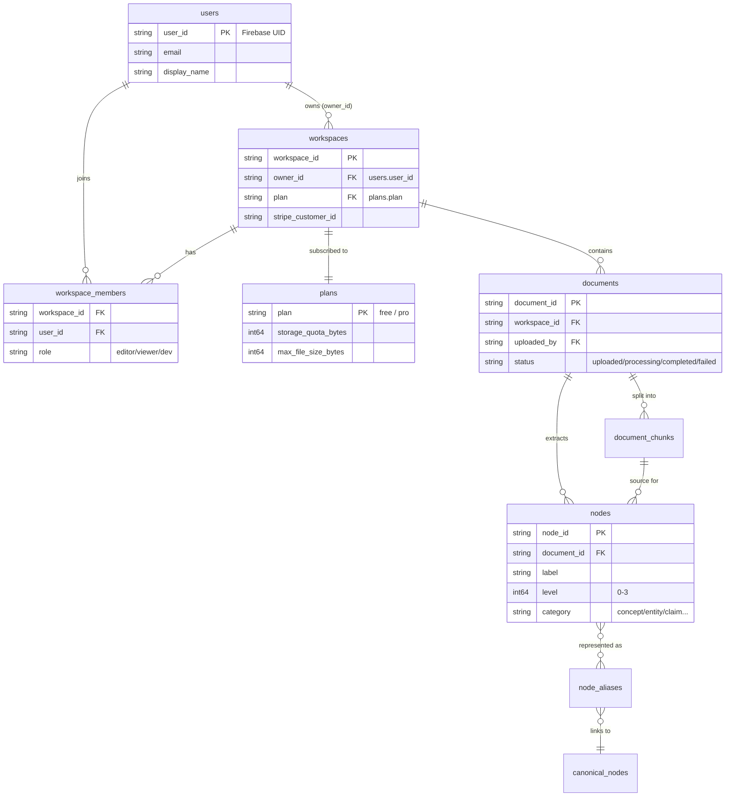

# ActionRev Data Model (Entity Relationship Diagram)

```mermaid
erDiagram
    users ||--o{ workspaces : "owns (owner_id)"
    users ||--o{ workspace_members : "joins"
    workspaces ||--o{ workspace_members : "has"
    workspaces ||--|| plans : "subscribed to"
    workspaces ||--o{ documents : "contains"
    documents ||--o{ document_chunks : "split into"
    documents ||--o{ nodes : "extracts"
    document_chunks ||--o{ nodes : "source for"
    nodes }o--o{ node_aliases : "represented as"
    node_aliases }o--|| canonical_nodes : "links to"

    users {
        string user_id PK "Firebase UID"
        string email
        string display_name
    }

    workspaces {
        string workspace_id PK
        string owner_id FK "users.user_id"
        string plan FK "plans.plan"
        string stripe_customer_id
    }

    workspace_members {
        string workspace_id FK
        string user_id FK
        string role "editor/viewer/dev"
    }

    plans {
        string plan PK "free / pro"
        int64 storage_quota_bytes
        int64 max_file_size_bytes
    }

    documents {
        string document_id PK
        string workspace_id FK
        string uploaded_by FK
        string status "uploaded/processing/completed/failed"
    }

    nodes {
        string node_id PK
        string document_id FK
        string label
        int64 level "0-3"
        string category "concept/entity/claim..."
    }

```
